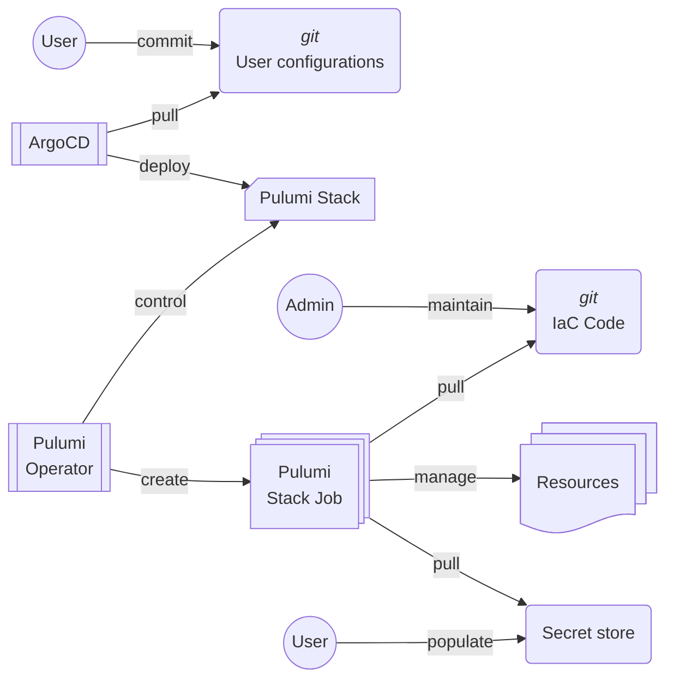

# High Level Design

## General Workflow

The workflow (general idea):

1. The user sets the secrets in the secret store.
2. The user commits changes to the repository (CRUD operations.)
3. ArgoCD pulls the wanted state.
4. ArgoCD generates the Kubernetes resources with a helm chart.
5. The Pulumi Operator detect the changes
6. The Pulumi Operator creates a job for the stack.
7. The Pulumi Stack Job pulls the IaC module.
8. The Pulumi Stack Job pulls the secrets.
9. The Pulumi Stack Job deploys the stack's resources.
10. ArgoCD detects the stack status and send a notification to the user.